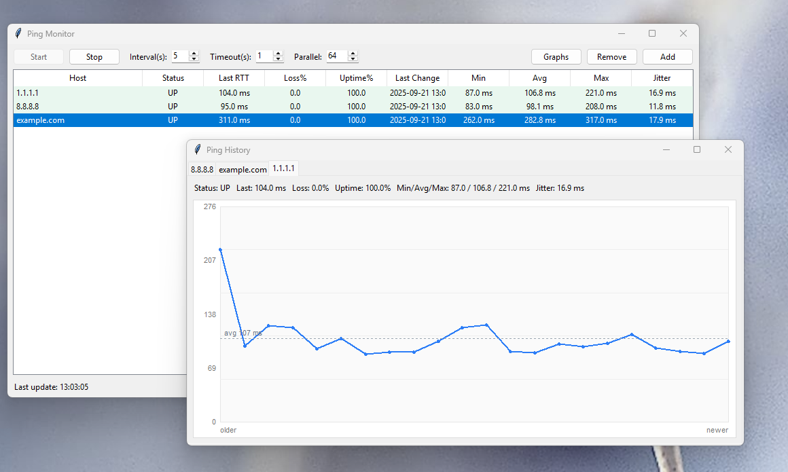

# Ping Monitor GUI

A clean, cross‑platform desktop app to continuously **ping multiple hosts** (servers, routers, DNS, websites) and visualize their health. It shows live status, loss/uptime, and a separate **Ping History** window with per‑host RTT graphs — great for small IT teams and homelab monitoring.

> **No admin/root required.** Uses the system `ping` command under the hood. On Windows, probe processes are completely hidden (no black CMD pop‑ups). The app also shuts down cleanly so no background pings are left running.



---

## ✨ Features

- **Live table** of hosts with: Status (UP/DOWN/FLAP), last RTT, Loss %, Uptime %, Last Change, Min/Avg/Max, Jitter.
- **Graphs window** (`Graphs` button): detachable window with a tab per host and a rolling RTT chart.
  - Blue line for RTT, dashed line for rolling average, **red x** marks for failed pings.
  - Auto‑scales the Y‑axis with headroom so spikes are readable.
- **Controls** for **Interval (s)**, **Timeout (s)**, and **Parallel** worker count.
- **Add/Remove hosts** quickly from the toolbar.
- **Responsive & safe**: background worker thread with a thread‑safe queue; graceful shutdown on window close.
- **Cross‑platform**: Windows, macOS, Linux — pure Python standard library (`tkinter`, `subprocess`, `concurrent.futures`).

---

## 📸 UI at a glance

```
+----------------------------------------------------------------------------------+
| Ping Monitor                                                     [ Start ] [Stop]|
| Interval: 5s   Timeout: 1s   Parallel: 64                       [ Add ] [Remove]|
|                                                                  [   Graphs   ]  |
+----------------------------------------------------------------------------------+
| Host            | Status  | Last RTT | Loss% | Uptime% | Last Change        |    |
|----------------------------------------------------------------------------------|
| 1.1.1.1         | UP      |   9 ms   |  0.0  | 100.0   | 2025‑09‑06 11:12   |    |
| 8.8.8.8         | UP      |  13 ms   |  0.0  |  99.2   | 2025‑09‑06 10:38   |    |
| example.com     | FLAP    |  75 ms   | 20.0  |  97.5   | 2025‑09‑06 11:11   |    |
+----------------------------------------------------------------------------------+
```

The **Graphs** window opens a separate window with tabs per host and simple, dependency‑free charts.

---

## 🚀 Quick start

**Requirements**
- Python **3.10+**
- `tkinter` (bundled with most Python installers)
- System `ping` available in your `PATH` (Windows/macOS/Linux default)

**Run**
```bash
# Clone your repo, then:
python ping_monitor_gui.py
```

- On Windows, you can also double‑click `ping_monitor_gui.py`.
- Demo hosts (`1.1.1.1`, `8.8.8.8`, `example.com`) are preloaded. Use **Add** to insert more hosts and **Remove** to delete selected rows.

---

## 🧭 Usage

- **Start / Stop**: begins or ends monitoring for all listed hosts.
- **Interval (s)**: how often each host is probed (default **5s**).
- **Timeout (s)**: per‑probe timeout (default **1s**).
- **Parallel**: maximum number of concurrent pings (default **64**).
- **Graphs**: opens the history window (one tab per host).
- **Statuses**
  - **UP**: last probe succeeded.
  - **DOWN**: last probe failed.
  - **FLAP**: recent mix of successes and failures (last few samples).

**Columns explained**
- **Last RTT**: most recent round‑trip time (ms).
- **Loss %** and **Uptime %**: computed over a rolling window (default **60** samples).
- **Min/Avg/Max** and **Jitter**: basic stats calculated from recent successful probes.
- **Last Change**: timestamp when host state last flipped (UP↔DOWN).

---

## 🛠️ How it works

- Uses the system `ping` with correct platform flags:
  - Windows: `ping -n 1 -w <timeout_ms>`
  - Linux/macOS: `ping -c 1 -W <timeout_s>`
- Parses RTT from the command output; if unavailable yet the call returned success, approximates via wall‑time.
- A `ThreadPoolExecutor` runs pings in parallel; results flow through a **thread‑safe queue** to the Tk main thread.
- **Hidden probes on Windows**: subprocesses are launched with `CREATE_NO_WINDOW` and hidden `STARTUPINFO` so no console windows appear.
- **Clean shutdown**: closing the window stops the engine, cancels UI timers, closes the Graphs window, and joins the worker thread.

---

## 🧪 Tested on

- **Windows 11** — no black CMD windows during probes.
- **Ubuntu / Debian** — works with the system `ping` (usually setuid or `cap_net_raw` enabled by the distro).
- **macOS** — standard `ping` on PATH.

> If your distro has restricted ICMP or `ping` isn’t on PATH, see Troubleshooting.

---

## 🐞 Troubleshooting

- **“Ping not found” / no results appear**
  - Ensure `ping` is in your PATH. On Linux/macOS it’s usually `/sbin/ping` or `/bin/ping`.
- **High Loss % or frequent DOWN**
  - Some networks/firewalls rate‑limit or block ICMP. Try increasing **Timeout** and **Interval**, or test with a nearer host.
- **Graphs window empty**
  - Start monitoring first. Charts render as samples arrive.
- **App didn’t exit cleanly**
  - Current build stops the engine on close. If a Python process persists, end it from Task Manager/Activity Monitor and report steps to reproduce.

---

## 📦 Packaging (optional)

Create a single‑file Windows executable with **PyInstaller**:

```bash
pip install pyinstaller
pyinstaller --name PingMonitor --onefile --windowed ping_monitor_gui.py
```
- `--windowed` prevents a console window from opening with the app itself.
- The app already hides child `ping` processes on Windows.

---

## 🧱 Project structure

Single file for now:

```
ping_monitor_gui.py
├─ Host / HostStats      # data & rolling statistics
├─ MonitorEngine         # worker thread + thread pool, system ping calls
├─ HistoryWindow         # separate window with per‑host RTT charts
└─ App (Tkinter/ttk)     # main UI: table, controls, event wiring
```

Planned split (future): `models.py`, `engine/monitor.py`, `ui/app.py`, `ui/history.py`, `alerts/notify.py`.

---

## 🗺️ Roadmap

- CSV/JSON import & export of host lists
- Persistent logging (SQLite) and daily uptime reports
- Tray icon + desktop notifications on state change or SLA breach
- Per‑host thresholds (max RTT, loss, jitter), **SLA** calculations
- Save settings (window size, columns, last host list)
- Export graph as PNG, and zoom/pan (optional matplotlib backend)


